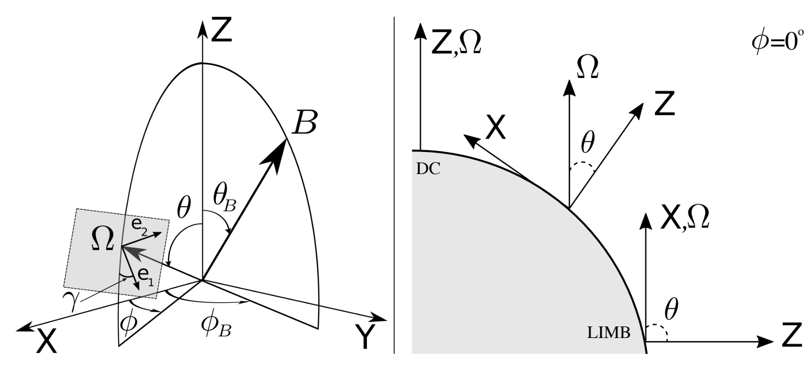
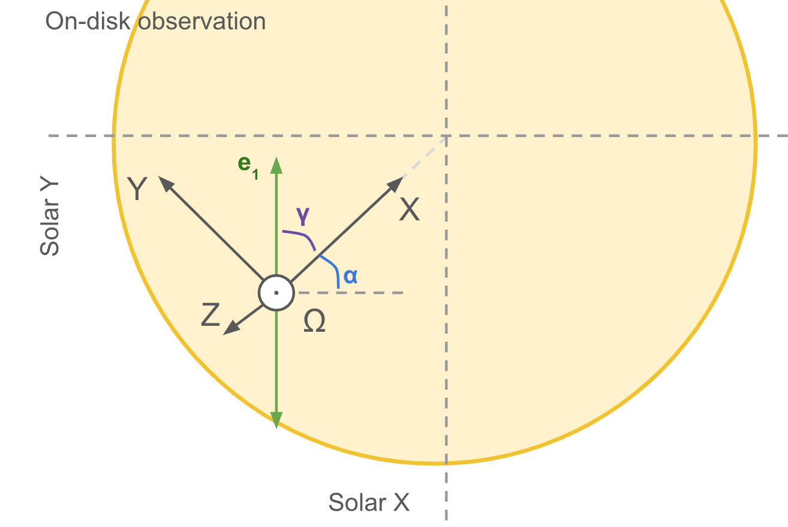
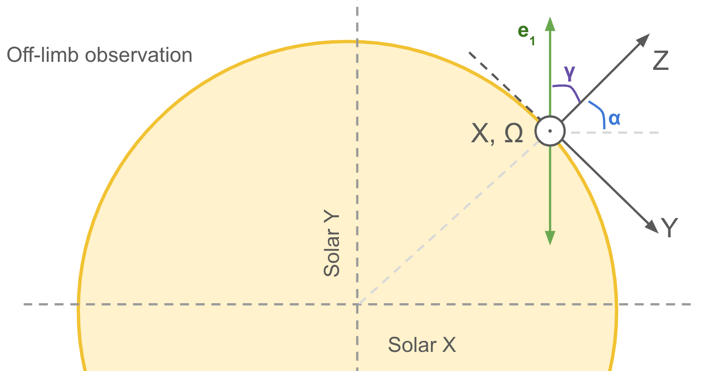

The reference system
====================

.. _Fig.1:

   
   Left) reference system used in Hazel. Right) configuration of the reference system choosing :math:`\chi=0` and for different values of :math:`\theta`.

We show in `Fig.1`_ the reference system used in Hazel. The capital letters :math:`X`, :math:`Y` and :math:`Z` are the reference directions in the local frame, with :math:`Z` pointing in the direction of the local vertical, and :math:`X` and :math:`Y` in the local horizontal plane parallel to the solar surface. The vector :math:`\Omega` is pointing in the direction of the observer and the plane perpendicular to that vector (where :math:`e_1` and :math:`e_2` are defined) is the plane of the sky. The vector :math:`\Omega` is defined by two angles: :math:`\theta` and :math:`\chi`. The angle :math:`\theta` is the heliocentric angle, which is the angle between the vector :math:`\Omega` and the local vertical. The angle :math:`\chi` is the azimuthal angle, which is the angle between the projection of the vector :math:`\Omega` in the local horizontal plane and the local X direction. The magnetic field has its own reference system, defined by the angles :math:`\gamma_B` and :math:`\phi_B` measured from the local X and Z directions, respectively.

For off-limb observations, we have :math:`\theta = 90`, while for observations on the solar disk, we have :math:`\theta < 90`. Without any lack of generality and for simplicity, :math:`\phi` is generally taken to be 0 so that the LOS vector is contained in the Z and X plane. For example, if :math:`\phi = 0` is chosen in an off-limb observation the :math:`\Omega` vector lies along the X axis, while for on-disk observations :math:`\Omega` lies somewhere between the Z and X axis, i.e., the projection of the X axis in the plane perpendicular to the LOS points towards the disk center (see right panel of `Fig.1`_). We could also choose :math:`\chi= 180`, then :math:`\Omega` is between :math:`Z` and :math:`-X`. However, for simplicity, we choose :math:`\chi= 0` unless we have a good reason to do it. The angle of the reference of the polarimeter is indicated with the angle :math:`\gamma` and it is measured from the local Z.

On-disk observation
-------------------

Let's consider an on-disk observation with location :math:`(x,y)`: (-300,-200) arcsec where the reference of the polarimeter (Q>0) is aligned with the solar N-S direction. As mentioned before, we choose :math:`\chi= 0` for simplicity. This means that the LOS is in between the Z and X axis, and the X axis is pointing towards the disk center. The angle :math:`\gamma` is measured from the plane X-Z towards the :math:`e_1` direction. Let's calculate the angles for this observation. A sketch of the reference system is shown in the following figure:

We start calculating the heliocentric angle:
::

    theta = arcsin(sqrt(x**2.+y**2.)/960.)*180/pi = 22.1d

Then we can calculate the angle from the solar equator:
::

    alpha = arctan(y/x)*180./pi = 33.7d

Now we can calculate :math:`\gamma` (must be measured from X to Y,
anticlockwise). In this case, :math:`\gamma` gives:
::

    gamma =(90 - alpha) = 56.3d

Then, the angles for this observation are:

::

    theta_OBS = 22.1d
    chi_OBS = 0.0d
    gamma_OBS = 56.3d

Off-limb observation
--------------------

Let's consider an off-limb observation with location :math:`(x,y)`: (+750,+600) arcsec where the reference of the polarimeter (Q>0) is aligned with the solar N-S direction. As mentioned before, we choose :math:`\chi= 0` for simplicity. A sketch of the reference system is shown in the following figure:

In this situation, the observations are at the limb, and as a consequence of choosing :math:`\chi= 0`, the X axis is pointing towards the observer parallel to the LOS. As in the previous example, the angle :math:`\gamma` is measured from the plane X-Z towards the :math:`e_1` direction. We follow the same procedure as for the on-disk observation. First, we calculate the heliocentric angle:
::

    theta = arcsin(sqrt(x**2.+y**2.)/960.)*180/pi = 90.0d

Then we can calculate the angle from the solar equator:
::

    alpha = arctan(y/x)*180./pi = 38.7d

So the angle :math:`\gamma` gives:
::

    gamma =(90 - alpha) = 51.3d

Then, the angles for this observation are:

::

    theta_OBS = 90.0d
    chi_OBS = 0.0d
    Gamma_OBS = 51.3d

