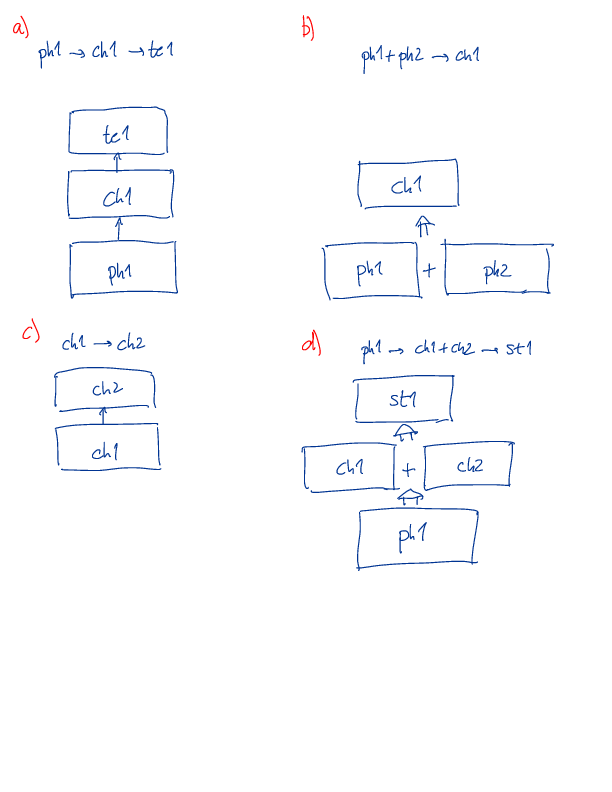

.. _topology:
.. include:: hazel_name

Topology
========

|hazel2| allows the user to select the topology of the atmospheres generating a certain
spectral region. The topology is fairly flexible, if some conditions that we
described later are fulfilled. Note that the magnetic properties of different atmospheres 
(specially photospheres and chromospheres) are independent, so that the idea of 
topologies are used to fit blended lines and avoid artifacts. The relation between
the physical properties of any atmospheric component has to be interpreted
by the user.

Notation and conditions
----------

The symbol :math:`\to` is used to indicate that
radiation passes from one set of atmospheres to the next, while the symbol :math:`+`
indicates that the atmospheres are added with a filling factor. Atmospheres are
ordered from deeper to shallower.

The conditions are the following:

* If a photosphere is used, it must lie at the deepest order (in other words, they must be first in the topology). Photospheres have the Planck function at the deepest point as boundary condition.
* If a photosphere is not used, then the typical continuum at the observing angle is used as boundary condition.
* If a straylight contamination is present, it must be the last contribution because it is added with a filling factor with the light emerging from the rest of atmospheres.

Examples
--------

In this figure we represent four typical configurations, where atmospheres starting
with ``ph`` are photospheres, the label ``ch`` is used for chromospheres, ``te``
is used for telluric contaminations and ``st`` is used for straylight contaminations.

* a) ``ph1 -> ch1 -> te1``: the light emerging from the photosphere is passed to the chromosphere and finally, absorbed by the telluric contamination. This is a typical configuration to invert the whole spectral region aroung 10830 :math:`\unicode{xC5}`.
* b) ``ph1 + ph2 -> ch1``: the light emerging from two photospheres is added with a filling factor and passed to the chromosphere. This might be used in a situation in which the photospheric signal is coming from non-resolved structures.
* c) ``ch1 -> ch2``: the light emerging from a chromosphere enters another one. This might be used for cases in which two components are seen in the He I multiplet.
* d) ``ph1 -> ch1 + ch2 -> st1``: the light emerging from the photosphere is passed to two chromospheres, that are added at the end with a filling factor. Finally, everything is contaminated with straylight.

